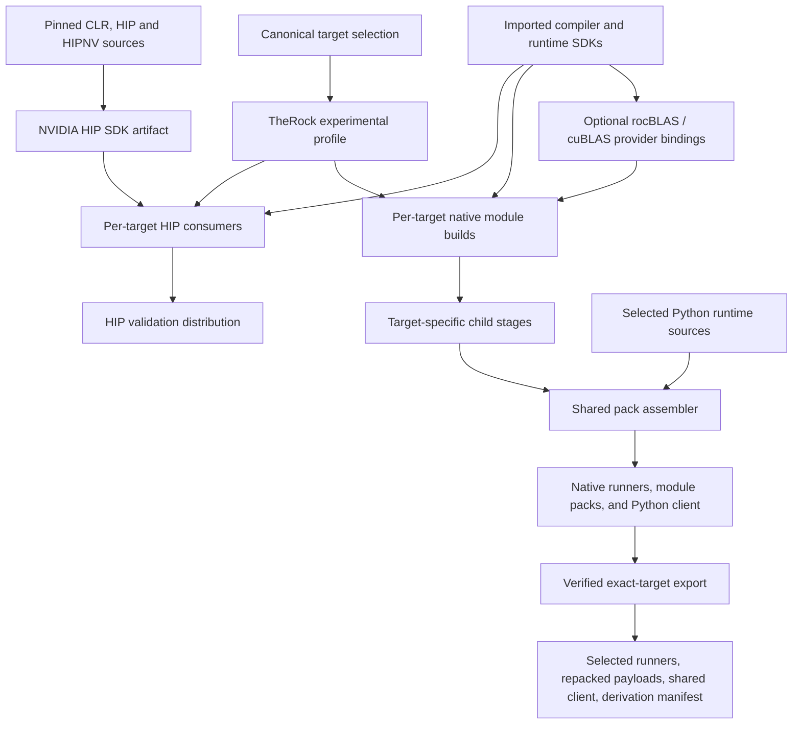
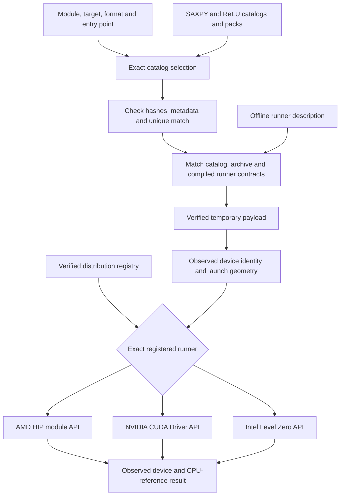

# Multi-vendor ROCm build and module architecture

**Status: experimental implementation and proposed expansion.** This document
describes the initial implementation validated on Shark-a on 6 September 2026,
the subsequent input, launch-contract, discovery, event, session, pipeline, service,
installed consumer, selective distribution, and bounded math-provider work, and
decisions needed to extend it.
The hardware validation record below remains tied to its stated checkpoint.
Operational commands belong in the [getting-started guide](multi-vendor-getting-started.md),
[build runbook](multi-vendor-hip.md), [selective-distribution guide](multi-vendor-distributions.md),
[SGEMM provider guide](multi-vendor-sgemm.md), and [imported-input guide](multi-vendor-inputs.md).

## Decision and scope

TheRock is ROCm's CMake superbuild. This design extends its build graph and
artifact infrastructure with explicit GPU backend identities. Vendor compilers
and runtime interfaces remain separate,
while sharing source selection, dependency tracking, staging, packaging, and
validation. Retain HIP source portability as one consumer of that infrastructure
and add native module consumers and explicit math providers alongside it.

The implemented `multi-vendor-hip` profile demonstrates this approach with AMD,
NVIDIA, and Intel payloads in the same build and distribution. It does **not**
deliver full ROCm support on NVIDIA or Intel. It supplies validation programs,
typed module packs, and backend build recipes; it does not supply a common
binary HIP ABI, production runtime dispatcher, complete math stack, or general
Intel HIP implementation.

The goals are to build multiple target variants reproducibly, package independent
modules without naming collisions, test execution on identified hardware, and
create an extension point for additional providers. Replacing vendor drivers,
retargeting arbitrary AMD machine code, and claiming compatibility from a
successful compilation are outside this increment.

## Implemented status and qualification

The AMD and NVIDIA execution devices are the Linux cards installed in Shark-a.
B70 hardware is pending; SM90 is a compilation target only. Qualification below
applies to the stated tests and toolchains, not every application or processor
accepted by the target parser.

| Reference target                                                        | Implemented path                                                               | Evidence and remaining qualification                                                                                                      |
| ----------------------------------------------------------------------- | ------------------------------------------------------------------------------ | ----------------------------------------------------------------------------------------------------------------------------------------- |
| AMD Radeon AI PRO R9700, `amd:hip:gfx1201`                              | Installed ROCm 7.2 SDK; HIP source tests and native HIP module loading         | HIP arithmetic, reduction, streams/events passed; packed SAXPY and ReLU HSACO execution passed.                                           |
| NVIDIA RTX PRO 6000 Blackwell Workstation Edition, `nvidia:cuda:sm_120` | Pinned HIPNV headers with CUDA 13.2; independent CUDA Driver API module loader | HIP tests passed; both SAXPY and ReLU passed through cubin and PTX loading.                                                               |
| NVIDIA `nvidia:cuda:sm_90`                                              | Additional compiler and pack variant                                           | Compilation, extraction, and architecture inspection passed. No SM90 hardware execution was performed.                                    |
| Intel Arc Pro B70, `intel:level-zero:xe2-b70`                           | Native Level Zero loader; OpenCL C to SPIR-V compilation                       | Both real SPIR-V modules compiled and passed offline validation. Intel execution remains unvalidated pending the card and compute driver. |
| Intel HIP/chipStar consumer                                             | Imported chipStar SDK integration                                              | Separate integration path retained; its toolchain and hardware execution have not been validated.                                         |

The three-vendor distribution contains eight payload variants across two
logical packs. Its AMD/NVIDIA packed tests passed in six cases. Attempting the
two Intel tests failed at driver initialization because no Intel device/compute
driver was available; these are explicit failures, not successful skips.

Later increments also add [verified dispatch](multi-vendor-dispatch.md),
[explicit events](multi-vendor-events.md), and
[multi-module sessions](multi-vendor-sessions.md).
[Device pipelines](multi-vendor-pipelines.md) also bind one stage's GPU output
to the next stage's input, keeping intermediates on device. Sessions load modules from
separate packs and reuse one native context and resource set. They preserve
exact target/format selection and the fixture ABI. The subsequent
[persistent service](multi-vendor-service.md) exposes connection-scoped module
and buffer handles with caller-supplied FP32 data. The
[installed Python client](multi-vendor-client.md) adds verified logical module
selection for applications and supports independent workers for multiple vendors
in one Python host. Public device/context/event
handles and a production shared-library interface remain roadmap work. Evidence
for these increments stays in separate snapshots rather than being added to the
initial checkpoint counts.

## Shared build graph

The entry point in [the root CMake project](../../CMakeLists.txt) defaults to the
existing `rocm` profile. The experimental profile branches before the normal
AMD compiler/runtime graph and returns through the shared
[finalization helper](../../cmake/therock_finalize.cmake). It therefore exercises
TheRock's existing subproject, dependency, artifact, and consumer-graph machinery
without first rebuilding the AMD runtime stack.

[Build topology](../../BUILD_TOPOLOGY.toml) adds an opt-in source/artifact group.
[Target configuration](../../build_tools/configure_multi_vendor.py) produces
`targets.cmake` and `gpu_targets.json`.
[The profile](../../experimental/multi-vendor/CMakeLists.txt) declares one child
build per selected target and a shared NVIDIA HIP SDK build. Native modules use
[their own graph](../../experimental/multi-vendor/module_packs.cmake).

Child stages isolate binaries under target slugs. Registered kernel sources
trigger outer rebuilds, child compilation, restaging, and pack assembly.
Compilation and packaging need toolchains, not GPUs; CTest is the hardware
execution boundary. Disabling `THEROCK_ENABLE_MULTI_VENDOR_VALIDATION` removes HIP
consumers while retaining native modules. Native Intel then avoids chipStar and
CMake's HIP-language requirement; the Intel HIP consumer requires CMake 4.3. The current profile still builds the NVIDIA header
SDK whenever NVIDIA is selected, including when HIP consumers are disabled.

## Identity, format, and capability are different contracts

[GpuTarget](../../build_tools/_therock_utils/gpu_targets.py) uses
`vendor:backend:processor[:feature+|-...]`. Vendor/backend combinations are
explicit: AMD/HIP, NVIDIA/CUDA, and Intel/Level Zero. AMD `xnack` and `sramecc`
features retain their signs and have normalized ordering. For example,
`amd:hip:gfx942:xnack+:sramecc-` canonicalizes to
`amd:hip:gfx942:sramecc-:xnack+`.

A filesystem slug encodes that identity safely; it is not the identity itself.
The target model separately provides compiler arguments and possible payload
formats. NVIDIA `sm_120` becomes CMake HIP architecture `120`; compiler suffixes
such as `sm_90a` remain compilation distinctions even though runtime attributes
report major/minor capability. Intel `xe2-b70` is a product label and never
becomes an invented compiler ISA flag.

Likewise, `spirv` identifies a payload contract, not B70 hardware. The native
Intel loader selects only root GPU devices from vendor `0x8086`, orders indices
by driver/device UUID, and checks B70 device ID `0xe223`. Other Intel product
labels require an explicit device ID. Intel's
[supported-device table](https://dgpu-docs.intel.com/overview/supported-hardware/xe-driver-gpus.html)
provides this identity; marketing names can vary between supported runtimes.

Parsing an identifier does not establish compiler support, API capability, or
hardware qualification. Generated target-selection metadata deliberately records
`unvalidated`. A future capability registry must express such properties as
subgroup operations, atomics, memory models, supported module versions, and
library coverage independently of processor spelling.

## Source, module, and library paths

### HIP source adapters

[HIP validation](../../tests/multi_vendor/README.md) compiles portable source
separately for each backend. NVIDIA uses CLR's existing `HIP_PLATFORM=nvidia`
installation recipe and retained HIPNV headers from pinned sources. This is the
previous HIP-on-CUDA approach used as an executable baseline. CUDA remains the
compiler/runtime prerequisite.

AMD imports its standard Linux HIP SDK. Intel HIP imports chipStar and requests
its Level Zero GPU backend. Its existing B70 check uses the device name and
remains unvalidated; the native PCI-ID check does not qualify that HIP path.
These paths can preserve familiar HIP source APIs,
but each produces a backend-specific executable and depends on its own
implementation. Header compatibility is not AMD HIP binary compatibility.
Coverage must be demonstrated for synchronization, allocation, reductions,
library calls, and extensions individually.

### Native device modules

[Native validation](../../tests/multi_vendor/modules/README.md) separates host
loading from device compilation. AMD and NVIDIA compile equivalent kernels from
`kernels.cpp`; Intel uses `kernels.cl`. AMD emits HSACO (AMD code objects) and loads through HIP
module APIs. NVIDIA emits cubin (compiled CUDA) and PTX (NVIDIA virtual ISA)
and loads through the CUDA Driver API;
its default host runner links `libcuda`, without HIP or `cudart`. The opt-in
SGEMM worker also links cuBLAS and needs its external runtime dependencies.

Intel's ordinary C++ host links the Level Zero loader. Clang emits SPIR64 LLVM
bitcode from OpenCL C 1.2; a matching LLVM-to-SPIR-V translator emits SPIR-V 1.0,
a portable intermediate representation.
`spirv-val --target-env opencl1.2` must pass before a temporary output becomes
the final payload. This follows Level Zero's
[Kernel/Physical64/OpenCL requirements](https://oneapi-src.github.io/level-zero-spec/level-zero/latest/core/SPIRV.html).

The Intel runner creates a module and kernel, sets five arguments, and uses host
and device allocations with an asynchronous queue. Barriers order input copies,
kernel execution, and readback. Finite synchronization precedes checking and
cleanup; unknown completion terminates the validator without freeing resources
that may still be in use.

All packed modules currently implement the fixture ABI
`(x, y, output, alpha, count)`, with SAXPY and ReLU references. This is a
deliberately small execution contract, not a general application launch ABI.

### Native math providers

The opt-in [SGEMM provider](multi-vendor-sgemm.md) adds FP32, column-major,
non-transposed `C = alpha * A * B + beta * C` through rocBLAS on AMD and
cuBLAS on NVIDIA. It reuses each persistent worker's existing primary context,
stream, and opaque buffers. The Python facade supplies dimensions, leading
dimensions, element offsets, and finite FP32 scalars; both client and worker
validate bounds and output aliasing before a library call. Dimensions are bounded
to 1..256 in this first contract.

This library operation has its own versioned contract and capability negotiation;
the vector ABI, pack catalogs, and runner registry schema remain unchanged.
Provider negotiation reports the loaded library version. It initializes one
provider handle lazily, binds the worker stream and host scalar mode, and selects
explicit FP32 math/atomics settings. SGEMM submission is queued; reads,
synchronization, and teardown drain the stream. Kernels and library calls can
therefore exchange device-resident buffers within a worker. Multiple vendors
still use separate workers and explicit host transfers.

`THEROCK_ENABLE_MULTI_VENDOR_SGEMM` defaults to `OFF`. Enabling it changes AMD
and NVIDIA runner capabilities and links their selected SDK's BLAS library;
Intel retains its native Level Zero module path and advertises no SGEMM provider.
An explicit Intel child-provider request fails configuration. The default module
worker retains its previous dependencies and description. Distributions and exact
target exports carry the matching bundled Python client and worker descriptions;
older host clients that reject unknown capabilities need the updated runtime.
The SDK libraries, transitive libraries, provider kernel data, and GPU drivers
remain external. This increment neither packages their complete runtime closure
nor provides a common vendor BLAS binary ABI.

The completed-stage description gate also checks an SGEMM option toggle before
direct installation: a newly configured provider capability cannot label an older
worker. Whole-SDK content locks already cover provider files under imported SDK
roots. Complete runtime provenance and reusable artifact keys remain separate
acceptance gates.

## Multi-pack and multi-architecture selection

The [catalog layer](../../build_tools/_therock_utils/payload_catalog.py) uses real
KPAK v1 archives and schema-1 JSON catalogs. Each logical module can occupy its
own pack while containing several target and format variants. The current packs
are `validation-saxpy` and `validation-relu`.

The archive's two-dimensional lookup is preserved: the module key is
`<logical-module>/<payload-format>`; the target key is the exact canonical
identifier. Legacy field names remain in the archive implementation, and
existing writers default to HSACO. Typed targets are not routed through the
legacy AMD compatibility matcher.

The distribution registry now supplies the backend-specific runner for an exact
requested target. The diagram's branches remain separate executable alternatives.
The explicit-runner validation interface is also retained.
The [validation wrapper](../../build_tools/validate_multi_vendor_modules.py)
requests an explicit module, target, format, and declared entry point. Selection
checks all supplied pack hashes, rejects ambiguous matches, enforces relative
path containment, and checks the selected archive's TOC, types, entry points,
and payload hash against its catalog. Schema-2 catalogs also bind an explicit
launch contract into each archive entry. Extraction returns the selected
metadata and bytes from the same verified snapshot. The wrapper then compares
the contract with the chosen runner's offline, versioned description before
starting payload execution.

There is no automatic cubin-to-PTX, architecture, or backend fallback. In
particular, the ReLU tests supply the SAXPY catalog first and must continue to
the pack that actually owns ReLU. SHA256 provides integrity relative to the
catalog, not publisher authentication or proof that device code is safe.

The [assembler](../../build_tools/assemble_multi_vendor_modules.py) reads all
required staged inputs before replacing managed outputs. It assembles both
packs privately, then publishes complete files. Missing or empty inputs preserve
previous published outputs. Publication is per file within a private build,
not an atomic transaction for a live deployment. The distribution carries
catalogs, packs, and native runners; loose compiler payloads stay in child stages.

### Explicit launch and adapter contracts

Native validation packs now use catalog schema 2 while retaining KPAK v1.
The logical `therock.validation.f32-vector` ABI, version 1, specifies five
ordered arguments, 64-bit device-pointer storage, a 128-item group, runner-owned
resources, ordered copies/launch/readback, and host-synchronized completion.
Binding remains backend-native; this is not a common packed argument block.

Each compiled runner provides a protocol-1 `--describe-contract` response with
`scope: "compiled-adapter"`. Pack assembly checks staged descriptions; execution
checks the actual runner's description, required capabilities, formats, symbols,
and full contract. Standalone payload modes repeat ABI/hash/format checks before
GPU initialization. The service validates its OPEN contract before initialization
and validates formats and kernels as modules are loaded into the open device scope.
Both paths check observed device/kernel limits before launch. Legacy schema-1
catalogs remain extractable but cannot qualify guarded execution.

This establishes a versioned boundary for the fixtures, not a general dispatch
plugin ABI or device qualification. See the
[module-contract guide](multi-vendor-module-contracts.md) for schemas, migration,
ownership, and remaining limits.

### Runtime discovery and registry dispatch

Pack assembly now publishes a schema-1 runner registry containing exact targets,
distribution-relative executable paths and hashes, compiled descriptions, and
catalog paths. A unified source-tree command discovers devices across those
runners or dispatches one exact target. The packed-module CTests use this path.

Native `--list-devices` reports observed properties through HIP, CUDA Driver, or
Level Zero without explicitly creating execution resources. This is distinct
from the offline `--describe-contract` response. Intel uses PCI identity and
reports an unknown architecture as null. Driver availability, identity matching,
and successful fixture execution remain separate observations. SM90 inventory
on an SM120 host therefore cannot qualify SM90 execution.

Dispatch verifies the selected executable, payload snapshot, and descriptions;
checks the selected device identity and contract geometry; then enters the
existing guarded native launch path. There is no implicit architecture or format
fallback. Unobservable architecture feature suffixes fail in this interface.
Native inventory schema 2 now carries a driver-reported device UUID. Callers can
select by UUID, and both UUID and ordinal dispatch pass the observed UUID to the
execution process. A changed ordinal-to-UUID mapping fails before explicitly
creating execution resources. This binds the selected device across the process
boundary without claiming a stable public device/context handle ABI.

See the [discovery and dispatch guide](multi-vendor-dispatch.md) for commands,
registry integrity, driver errors, process-local ordinals, and remaining limits.

### Event dependencies across queues

The native fixtures now submit upload, compute, and readback through three queues
with explicit event dependencies. The logical kernel ABI and contract hash stay
unchanged; compiled adapters additionally advertise `cross-queue-events`.
Callers can require that capability, and packed-module CTests do so before
qualifying the new path. An older compatible adapter is still usable for the
original contract but cannot satisfy an event-required run.

AMD/NVIDIA use nonblocking streams and timing-disabled events. Level Zero uses
three asynchronous queue handles, regular command lists, and explicit device/host
event visibility scopes. Completion governs event/list reuse and resource
release, including partial-submission failures. This is an internal fixture path,
not a public event-handle ABI or a claim of physical overlap or performance.
See the [event validation guide](multi-vendor-events.md).

### Persistent module workers

Service RPC v1 adds a connection-scoped worker with opaque module and buffer
handles, offset transfers, launches, synchronization, and release. The Python
client validates HELLO against the expected compiled description before OPEN
binds the selected device UUID. The verified `run-service` command obtains
payloads from catalogs and exercises one to three composed stages with caller
data. Direct client sessions support 32 live modules and 64 live buffers.

AMD/NVIDIA keep one nonblocking stream and may acknowledge queued launches before
completion; Intel completes each operation on one persistent queue before its
reply. All paths drain before freeing referenced resources. This is a bounded
process API with the existing vector kernel ABI, not a shared-library C ABI or
public event interface. See the [service guide](multi-vendor-service.md) for
wire framing, ownership, failures, and qualification.

### Installed application client

The staged `therock_multi_vendor` Python package exposes `open_session` and
`ModuleRequest`. It shares exact pack/device selection with the validation CLI,
loads the complete declared module set before returning a session, and retains
private verified payload files through cleanup. Public module lookup does not
accept arbitrary filesystem paths. Existing opaque buffers and loaded modules
support application-provided data and repeated launches.

The shared pack child builds and installs the selected Python runtime and an
example alongside runners and packs. The runtime manifest binds its declared
source files to staged output bytes; install checks those inputs before replacing
prior outputs. Python dependencies and vendor SDK/driver dependencies remain
external. The included kpack code is an archive-reader subset, not the full
kpack transformation toolkit.

One Python consumer can retain AMD and NVIDIA sessions together. Intermediate
values cross that boundary through explicit host READ/WRITE operations; handles
remain local to their worker. Isolated imports and a relocated distribution
exercise checkout independence. This does not add a shared device address space,
a multi-device worker, general kernel arguments, or a shared-library C ABI.
See the [client guide](multi-vendor-client.md) for the API and validation scope.

### Separate legacy C++ kpack repair

The [C++ loader change](https://github.com/powderluv/rocm-systems/blob/a5dd53d3be5ced72d3e1f521c2067d341aadece3/shared/kpack/runtime/src/loader.cpp)
fixes an independent AMD runtime issue: a pack advertising a compatible
architecture could previously be selected before checking whether it contained
the requested module/code-object index.

Selection now checks module coverage while preserving requested-architecture,
feature-specificity, and search-path precedence. Duplicate modules retain the
first matching pack's precedence; a corrupt selected payload is not silently
replaced by a duplicate. This repair does not turn the C++ loader into the new
multi-vendor catalog selector. The imported AMD SDK was not rebuilt with it.

## SDK and artifact boundaries

The NVIDIA header SDK is a backend-specific, target-neutral artifact in the
`hip-nvidia` distribution. Validation executables and device packs use explicit
bundle names derived from selected targets. The
[artifact API](../../cmake/therock_artifacts.cmake) adds `DIST_BUNDLE_NAME` while
preserving existing AMD defaults.

Explicit bundles reject the AMD-only kpack split pipeline. CUDA and SPIR-V
payloads must never enter AMD code-object extraction or rewriting merely because
they share a packaging layer.

ROCm, CUDA, chipStar, and Level Zero SDKs remain imported dependencies where
applicable. The Level Zero development prefix is separate from the chipStar
prefix. Shark-a's isolated loader/header package is 1.16.1, exposing API 1.9;
that loader is not an Intel compute driver.

The profile now captures immutable content locks for declared SDK trees and
tool executables, with observed locations in a separate provenance report.
Configuration, participating producer/artifact operations, and CTest fixtures
verify those inputs. An in-place SDK change fails against the existing lock;
operators must restore the inputs, use a clean build, or explicitly select a
reviewed replacement lock. The provenance file also participates in consumer
rebuild dependencies. Completed validation builds install receipts containing
that observation; pack assembly and CTest reject missing or stale receipts.
This prevents an explicit lock update from relabeling old staged payloads or
qualifying an old test binary. Receipts establish local build ordering rather
than authenticated output provenance. See the
[imported-input guide](multi-vendor-inputs.md).

These identities cover declared inputs only. Compiler-discovered host headers,
dynamic libraries, subprocesses, environment, driver state, and the complete
toolchain closure remain outside that scope. Affected artifact fingerprints
remain disabled, and unqualified prebuilt stages are rejected. A production
solution still needs pinned provider recipes, options, runtime ABI requirements,
and redistribution boundaries recorded in complete build provenance.

## Alternatives Considered

**HIP-only wrappers.** They offer the shortest route for existing HIP source and
reuse established API mappings. They also couple progress to wrapper coverage
and do not automatically cover vendor libraries or AMD-specific assumptions.
Retain this path for source portability, without making every native consumer
depend on it.

**Native backend plugins.** They expose each driver's module, queue, and memory
semantics directly and support separate native/JIT payload policies. The cost
is implementing and maintaining capability negotiation, object ownership,
errors, and a stable dispatch ABI. The current loaders provide evidence for
this direction; reusable plugins are still proposed.

**SYCL or another portable runtime.** This could supply language and execution
portability, especially for new code and Intel tooling. Adopting it would add
another dependency and compatibility surface rather than remove the need for
backend qualification, packaging, or existing HIP API coverage. It remains a
candidate provider, not the selected universal interface.

**Retarget the whole stack through common IR.** LLVM IR or SPIR-V can share some
compiler infrastructure, as Intel payload generation demonstrates. Neither
erases address-space rules, subgroup assumptions, intrinsics, runtime services,
or library ABI differences. General retargeting would require substantially
more compiler/runtime work than this build-layer extension.

**One monolithic fat binary.** Embedding every backend and architecture could
simplify single-file delivery. It increases update size, couples independent
modules, and still needs typed selection and runtime dispatch. Separate packs
support independent composition and updates, at the cost of catalog management
and explicit duplicate policy. No size/performance superiority is claimed
without measurements.

## Selective delivery from a shared build

[Exact-target export](multi-vendor-distributions.md) derives smaller distributions
from a completed multi-target build. It retains each selected target's runners,
all registered logical modules and formats, and the shared installed Python client.
Selected payloads are verified and repacked, so omitted targets have neither
runner files nor device bytes in the result. The exporter requires no GPU or
access to the SDKs that originally built the distribution.

Original build receipts and provenance remain unchanged. A separate derivation
manifest records source identities, the selected targets, and the exact exported
file inventory. This adds selective delivery without treating repackaging as a
new build or enabling artifact-cache reuse. Exports use new destination directories;
incremental install/uninstall ownership and complete runtime dependency closure
remain future work. The installed client still verifies exact device identities
and contract compatibility when executing an exported payload.

## Roadmap and acceptance gates

1. **Qualify Intel hardware.** Install a B70-capable compute driver, confirm the
   selected PCI identity, and run packed Level Zero tests. Record JIT logs,
   arithmetic, ordering, cleanup, and toolchain versions; offline validation
   alone cannot close this gate.
1. **Complete build provenance.** Declared SDK/tool content locks and guards are
   implemented. Add pinned toolchain/provider recipes and capture implicit
   dependencies, options, and runtime ABI requirements. Restore cache reuse only
   when equivalent inputs produce equivalent keys and prebuilt imports carry
   original build provenance. Preserve existing AMD profile behavior.
1. **Define capabilities and dispatch ABI.** The versioned fixture launch contract
   and compiled-adapter negotiation are implemented, along with native device
   discovery, registry-based process dispatch, and UUID identity binding across
   discovery and execution. Native event dependencies across three queues are now
   exercised by the fixtures. Multi-module sessions reuse an internal context,
   allocations, queues, and events while retaining loaded modules. Device
   pipelines compose packed kernels through alternating scratch buffers. The
   persistent process service now supplies opaque module/buffer handles, explicit
   release, offset transfers, and versioned framing/errors for caller data. The
   installed Python facade adds verified module selection and retains independent
   vendor workers within one application.
   Extend beyond the fixed vector binding to public device/context/event
   ownership, general argument layouts, and an agreed shared-library ABI.
   Unsupported operations must fail explicitly. Define any fallback policy
   separately from exact identity.
1. **Expand math providers incrementally.** The bounded native rocBLAS/cuBLAS
   SGEMM operation establishes the first explicit provider contract. Integrate an
   Intel provider and qualify it on B70, then consider transpose/layout coverage,
   further BLAS operations, FFT, sparse, solver, and DNN support. Map vendor
   libraries or portable kernels through explicit provider contracts, testing
   numerical tolerances and synchronization. A matching function name is
   insufficient.
1. **Integrate production consumers.** Connect catalog selection to an agreed
   runtime plugin interface, qualify real applications, and add per-backend CI.
   Performance, package size, startup/JIT cost, and operational stability become
   measured acceptance criteria before broader support claims.

## Validation record and reproducible handoff

The initial implementation's broader Python regression run recorded
**137 passed and one failure** in
`ManifestValidationTest.test_artifact_subprojects_matches_cmake`. Pristine
baseline and working-tree default configurations produced the same artifact
mapping; checked-in manifest drift predates this change. The suite is therefore
not reported as entirely green.

Earlier independent kpack runs recorded **110 C++ runtime tests passed**, including
nine new regressions, and **38 Python kpack tests passed**. Focused subsets and
repeated GPU runs overlap these records and must not be added into an inflated
grand total. Source-change rebuilds, no-op builds, SDK switching, repeated
validator failure, and device-ID rejection checks also passed.

Evidence is local to Shark-a under
`build/multi-vendor/validation-results/`, with successive `report.json`,
`module-packs/report.json`, and `level-zero/report.json` snapshots. Later reports
supersede older Intel-status statements. Build outputs and evidence are not
automatically part of a Git clone.

The hardware and regression evidence above belongs to implementation checkpoint
TheRock
`6d531456f00841cca5247983a0750c921155f22d`, referencing `rocm-systems`
`a5dd53d3be5ced72d3e1f521c2067d341aadece3` (module-aware C++ lookup), which includes
`3dbb0eaebbc7b02891b1b54725410221b20ff115` (typed Python payloads). Forty-two
recorded source hashes matched that initial validation snapshot, and its
commit-time changed-file checks passed.

The complete implementation and guides are published on the
[powderluv/TheRock multi-vendor branch](https://github.com/powderluv/TheRock/tree/users/powderluv/multi-vendor-rocm).
The required child commits are on the matching
[powderluv/rocm-systems branch](https://github.com/powderluv/rocm-systems/tree/users/powderluv/multi-vendor-rocm).
This experimental branch configures that fork in `.gitmodules` and retains the
exact child commit above. Use pinned source fetching (`--no-remote`); following
`develop` would discard the tested child changes.

The installed-client checkpoint passed 345 focused regression tests, 26 native
profile CTests, and 30 combined HIP/native CTests. The consumer also passed from
a relocated distribution outside the checkout. Those suites overlap and do not
form an additive test total. Intel B70 and SM90 hardware execution remain
unqualified. See the [getting-started guide](multi-vendor-getting-started.md) for
clone, dependency, build, application, and validation commands. Build outputs and
machine-local evidence are not included in the source repository; record both
repository revisions and external SDK versions when reproducing the work.

The selective-export checkpoint adds 17 CPU export tests to the focused suite
(**362 passed, no skips**). Its native and combined profiles pass **29** and
**33 CTests**, respectively, including three relocated selected-distribution
consumers per profile. Five copied-source exports preserve exact payload counts
for AMD, NVIDIA, their pair, NVIDIA multi-architecture, and Intel-only selections.
Intel and SM90 execution remain deferred; source-independent export is packaging
evidence. See the [selective-distribution guide](multi-vendor-distributions.md).

The bounded SGEMM checkpoint passed **394 focused regression tests without skips**,
**32 enabled native CTests**, and **33 default combined HIP/native CTests**.
rocBLAS on R9700 and cuBLAS on RTX PRO 6000 passed matrix bounds/scalar cases,
unchanged input and guard checks, packed-kernel/library stream composition, and
a paired host-transfer/worker-lifetime test. A relocated selected AMD/NVIDIA
distribution passed SGEMM and retained its verified inventory. Intel and SM90
remain compile-only targets; no Intel math provider is implemented. See the
[provider guide](multi-vendor-sgemm.md) for the contract, loaded library versions,
commands, and limits.
