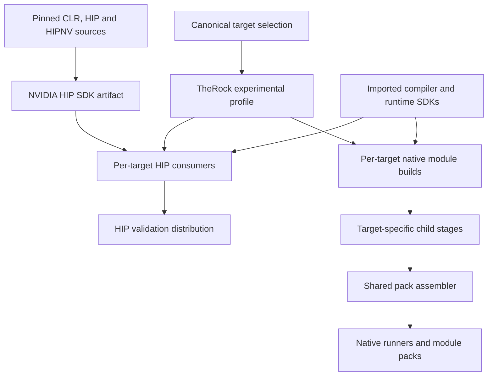
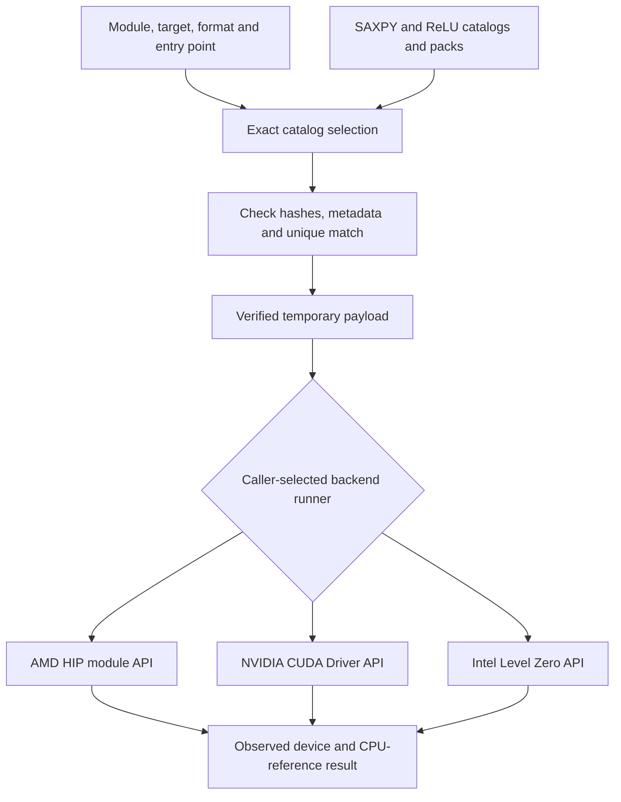

# Multi-vendor ROCm build and module architecture

**Status: experimental implementation and proposed expansion.** This document
describes the implementation validated on Shark-a on 6 September 2026 and the
decisions needed to extend it. Operational commands belong in the
[build runbook](multi-vendor-hip.md).

## Decision and scope

TheRock is ROCm's CMake superbuild. This design extends its build graph and
artifact infrastructure with explicit GPU backend identities. Vendor compilers
and runtime interfaces remain separate,
while sharing source selection, dependency tracking, staging, packaging, and
validation. Retain HIP source portability as one consumer of that infrastructure
and add native module consumers as another.

The implemented `multi-vendor-hip` profile demonstrates this approach with AMD,
NVIDIA, and Intel payloads in the same build and distribution. It does **not**
deliver full ROCm support on NVIDIA or Intel. It supplies validation programs,
typed module packs, and backend build recipes; it does not supply a common
binary HIP ABI, production runtime dispatcher, complete math stack, or general
Intel HIP implementation.

The goals are to build multiple target variants reproducibly, package independent
modules without naming collisions, test execution on identified hardware, and
create an extension point for additional providers. Replacing vendor drivers,
retargeting arbitrary AMD machine code, and claiming compatibility from a
successful compilation are outside this increment.

## Implemented status and qualification

The AMD and NVIDIA execution devices are the Linux cards installed in Shark-a.
B70 hardware is pending; SM90 is a compilation target only. Qualification below
applies to the stated tests and toolchains, not every application or processor
accepted by the target parser.

| Reference target                                                        | Implemented path                                                               | Evidence and remaining qualification                                                                                                      |
| ----------------------------------------------------------------------- | ------------------------------------------------------------------------------ | ----------------------------------------------------------------------------------------------------------------------------------------- |
| AMD Radeon AI PRO R9700, `amd:hip:gfx1201`                              | Installed ROCm 7.2 SDK; HIP source tests and native HIP module loading         | HIP arithmetic, reduction, streams/events passed; packed SAXPY and ReLU HSACO execution passed.                                           |
| NVIDIA RTX PRO 6000 Blackwell Workstation Edition, `nvidia:cuda:sm_120` | Pinned HIPNV headers with CUDA 13.2; independent CUDA Driver API module loader | HIP tests passed; both SAXPY and ReLU passed through cubin and PTX loading.                                                               |
| NVIDIA `nvidia:cuda:sm_90`                                              | Additional compiler and pack variant                                           | Compilation, extraction, and architecture inspection passed. No SM90 hardware execution was performed.                                    |
| Intel Arc Pro B70, `intel:level-zero:xe2-b70`                           | Native Level Zero loader; OpenCL C to SPIR-V compilation                       | Both real SPIR-V modules compiled and passed offline validation. Intel execution remains unvalidated pending the card and compute driver. |
| Intel HIP/chipStar consumer                                             | Imported chipStar SDK integration                                              | Separate integration path retained; its toolchain and hardware execution have not been validated.                                         |

The three-vendor distribution contains eight payload variants across two
logical packs. Its AMD/NVIDIA packed tests passed in six cases. Attempting the
two Intel tests failed at driver initialization because no Intel device/compute
driver was available; these are explicit failures, not successful skips.

## Shared build graph

The entry point in [the root CMake project](../../CMakeLists.txt) defaults to the
existing `rocm` profile. The experimental profile branches before the normal
AMD compiler/runtime graph and returns through the shared
[finalization helper](../../cmake/therock_finalize.cmake). It therefore exercises
TheRock's existing subproject, dependency, artifact, and consumer-graph machinery
without first rebuilding the AMD runtime stack.

[Build topology](../../BUILD_TOPOLOGY.toml) adds an opt-in source/artifact group.
[Target configuration](../../build_tools/configure_multi_vendor.py) produces
`targets.cmake` and `gpu_targets.json`.
[The profile](../../experimental/multi-vendor/CMakeLists.txt) declares one child
build per selected target and a shared NVIDIA HIP SDK build. Native modules use
[their own graph](../../experimental/multi-vendor/module_packs.cmake).

Child stages isolate binaries under target slugs. Registered kernel sources
trigger outer rebuilds, child compilation, restaging, and pack assembly.
Compilation and packaging need toolchains, not GPUs; CTest is the hardware
execution boundary. Disabling `THEROCK_ENABLE_MULTI_VENDOR_VALIDATION` removes HIP
consumers while retaining native modules. Native Intel then avoids chipStar and
CMake's HIP-language requirement; the Intel HIP consumer requires CMake 4.3. The current profile still builds the NVIDIA header
SDK whenever NVIDIA is selected, including when HIP consumers are disabled.

## Identity, format, and capability are different contracts

[GpuTarget](../../build_tools/_therock_utils/gpu_targets.py) uses
`vendor:backend:processor[:feature+|-...]`. Vendor/backend combinations are
explicit: AMD/HIP, NVIDIA/CUDA, and Intel/Level Zero. AMD `xnack` and `sramecc`
features retain their signs and have normalized ordering. For example,
`amd:hip:gfx942:xnack+:sramecc-` canonicalizes to
`amd:hip:gfx942:sramecc-:xnack+`.

A filesystem slug encodes that identity safely; it is not the identity itself.
The target model separately provides compiler arguments and possible payload
formats. NVIDIA `sm_120` becomes CMake HIP architecture `120`; compiler suffixes
such as `sm_90a` remain compilation distinctions even though runtime attributes
report major/minor capability. Intel `xe2-b70` is a product label and never
becomes an invented compiler ISA flag.

Likewise, `spirv` identifies a payload contract, not B70 hardware. The native
Intel loader selects only root GPU devices from vendor `0x8086`, orders indices
by driver/device UUID, and checks B70 device ID `0xe223`. Other Intel product
labels require an explicit device ID. Intel's
[supported-device table](https://dgpu-docs.intel.com/overview/supported-hardware/xe-driver-gpus.html)
provides this identity; marketing names can vary between supported runtimes.

Parsing an identifier does not establish compiler support, API capability, or
hardware qualification. Generated target-selection metadata deliberately records
`unvalidated`. A future capability registry must express such properties as
subgroup operations, atomics, memory models, supported module versions, and
library coverage independently of processor spelling.

## Two implementation paths

### HIP source adapters

[HIP validation](../../tests/multi_vendor/README.md) compiles portable source
separately for each backend. NVIDIA uses CLR's existing `HIP_PLATFORM=nvidia`
installation recipe and retained HIPNV headers from pinned sources. This is the
previous HIP-on-CUDA approach used as an executable baseline. CUDA remains the
compiler/runtime prerequisite.

AMD imports its standard Linux HIP SDK. Intel HIP imports chipStar and requests
its Level Zero GPU backend. Its existing B70 check uses the device name and
remains unvalidated; the native PCI-ID check does not qualify that HIP path.
These paths can preserve familiar HIP source APIs,
but each produces a backend-specific executable and depends on its own
implementation. Header compatibility is not AMD HIP binary compatibility.
Coverage must be demonstrated for synchronization, allocation, reductions,
library calls, and extensions individually.

### Native device modules

[Native validation](../../tests/multi_vendor/modules/README.md) separates host
loading from device compilation. AMD and NVIDIA compile equivalent kernels from
`kernels.cpp`; Intel uses `kernels.cl`. AMD emits HSACO (AMD code objects) and loads through HIP
module APIs. NVIDIA emits cubin (compiled CUDA) and PTX (NVIDIA virtual ISA)
and loads through the CUDA Driver API;
its host runner links `libcuda`, without HIP or `cudart`.

Intel's ordinary C++ host links the Level Zero loader. Clang emits SPIR64 LLVM
bitcode from OpenCL C 1.2; a matching LLVM-to-SPIR-V translator emits SPIR-V 1.0,
a portable intermediate representation.
`spirv-val --target-env opencl1.2` must pass before a temporary output becomes
the final payload. This follows Level Zero's
[Kernel/Physical64/OpenCL requirements](https://oneapi-src.github.io/level-zero-spec/level-zero/latest/core/SPIRV.html).

The Intel runner creates a module and kernel, sets five arguments, and uses host
and device allocations with an asynchronous queue. Barriers order input copies,
kernel execution, and readback. Finite synchronization precedes checking and
cleanup; unknown completion terminates the validator without freeing resources
that may still be in use.

All runners currently implement only the fixture ABI
`(x, y, output, alpha, count)`, with SAXPY and ReLU references. This is a
deliberately small execution contract, not a general application launch ABI.

## Multi-pack and multi-architecture selection

The [catalog layer](../../build_tools/_therock_utils/payload_catalog.py) uses real
KPAK v1 archives and schema-1 JSON catalogs. Each logical module can occupy its
own pack while containing several target and format variants. The current packs
are `validation-saxpy` and `validation-relu`.

The archive's two-dimensional lookup is preserved: the module key is
`<logical-module>/<payload-format>`; the target key is the exact canonical
identifier. Legacy field names remain in the archive implementation, and
existing writers default to HSACO. Typed targets are not routed through the
legacy AMD compatibility matcher.

The caller supplies one backend-specific runner executable; the diagram's
branches are alternatives, not an in-process runtime dispatcher.
The [validation wrapper](../../build_tools/validate_multi_vendor_modules.py)
requests an explicit module, target, format, and declared entry point. Selection
checks all supplied pack hashes, rejects ambiguous matches, enforces relative
path containment, and checks the selected archive's TOC, types, entry points,
and payload hash against its catalog. Extraction uses the bytes already hashed.

There is no automatic cubin-to-PTX, architecture, or backend fallback. In
particular, the ReLU tests supply the SAXPY catalog first and must continue to
the pack that actually owns ReLU. SHA256 provides integrity relative to the
catalog, not publisher authentication or proof that device code is safe.

The [assembler](../../build_tools/assemble_multi_vendor_modules.py) reads all
required staged inputs before replacing managed outputs. It assembles both
packs privately, then publishes complete files. Missing or empty inputs preserve
previous published outputs. Publication is per file within a private build,
not an atomic transaction for a live deployment. The distribution carries
catalogs, packs, and native runners; loose compiler payloads stay in child stages.

### Separate legacy C++ kpack repair

The [C++ loader change](../../rocm-systems/shared/kpack/runtime/src/loader.cpp)
fixes an independent AMD runtime issue: a pack advertising a compatible
architecture could previously be selected before checking whether it contained
the requested module/code-object index.

Selection now checks module coverage while preserving requested-architecture,
feature-specificity, and search-path precedence. Duplicate modules retain the
first matching pack's precedence; a corrupt selected payload is not silently
replaced by a duplicate. This repair does not turn the C++ loader into the new
multi-vendor catalog selector. The imported AMD SDK was not rebuilt with it.

## SDK and artifact boundaries

The NVIDIA header SDK is a backend-specific, target-neutral artifact in the
`hip-nvidia` distribution. Validation executables and device packs use explicit
bundle names derived from selected targets. The
[artifact API](../../cmake/therock_artifacts.cmake) adds `DIST_BUNDLE_NAME` while
preserving existing AMD defaults.

Explicit bundles reject the AMD-only kpack split pipeline. CUDA and SPIR-V
payloads must never enter AMD code-object extraction or rewriting merely because
they share a packaging layer.

ROCm, CUDA, chipStar, and Level Zero SDKs remain imported dependencies where
applicable. The Level Zero development prefix is separate from the chipStar
prefix. Shark-a's isolated loader/header package is 1.16.1, exposing API 1.9;
that loader is not an Intel compute driver.

Imported SDK/compiler content identities are not yet incorporated into reusable
fingerprints, so affected validation artifacts disable cache reuse. Changing SDK
prefixes updates discovered include/link paths, but replacing compiler or SDK
contents in place requires a clean build. A production solution needs source
revisions, tool hashes, options, runtime ABI requirements, and redistribution
boundaries recorded in artifact provenance.

## Alternatives Considered

**HIP-only wrappers.** They offer the shortest route for existing HIP source and
reuse established API mappings. They also couple progress to wrapper coverage
and do not automatically cover vendor libraries or AMD-specific assumptions.
Retain this path for source portability, without making every native consumer
depend on it.

**Native backend plugins.** They expose each driver's module, queue, and memory
semantics directly and support separate native/JIT payload policies. The cost
is implementing and maintaining capability negotiation, object ownership,
errors, and a stable dispatch ABI. The current loaders provide evidence for
this direction; reusable plugins are still proposed.

**SYCL or another portable runtime.** This could supply language and execution
portability, especially for new code and Intel tooling. Adopting it would add
another dependency and compatibility surface rather than remove the need for
backend qualification, packaging, or existing HIP API coverage. It remains a
candidate provider, not the selected universal interface.

**Retarget the whole stack through common IR.** LLVM IR or SPIR-V can share some
compiler infrastructure, as Intel payload generation demonstrates. Neither
erases address-space rules, subgroup assumptions, intrinsics, runtime services,
or library ABI differences. General retargeting would require substantially
more compiler/runtime work than this build-layer extension.

**One monolithic fat binary.** Embedding every backend and architecture could
simplify single-file delivery. It increases update size, couples independent
modules, and still needs typed selection and runtime dispatch. Separate packs
support independent composition and updates, at the cost of catalog management
and explicit duplicate policy. No size/performance superiority is claimed
without measurements.

## Roadmap and acceptance gates

1. **Qualify Intel hardware.** Install a B70-capable compute driver, confirm the
   selected PCI identity, and run packed Level Zero tests. Record JIT logs,
   arithmetic, ordering, cleanup, and toolchain versions; offline validation
   alone cannot close this gate.
1. **Stabilize build inputs.** Add pinned toolchain/provider recipes and imported
   SDK provenance. Restore cache reuse only when equivalent inputs produce
   equivalent keys. Preserve existing AMD profile behavior.
1. **Define capabilities and dispatch ABI.** Specify discovery, context and
   allocation ownership, streams/queues, events, argument layout, module
   lifetime, errors, and version negotiation. Unsupported operations must fail
   explicitly. Define any fallback policy separately from exact identity.
1. **Add math providers incrementally.** Start with a bounded BLAS operation,
   then expand to FFT, sparse, solver, and DNN coverage. Map vendor libraries or
   portable kernels through explicit provider contracts, testing numerical
   tolerances and synchronization. A matching function name is insufficient.
1. **Integrate production consumers.** Connect catalog selection to an agreed
   runtime plugin interface, qualify real applications, and add per-backend CI.
   Performance, package size, startup/JIT cost, and operational stability become
   measured acceptance criteria before broader support claims.

## Validation record and reproducible handoff

The latest Python regression run recorded **137 passed and one failure** in
`ManifestValidationTest.test_artifact_subprojects_matches_cmake`. Pristine
baseline and working-tree default configurations produced the same artifact
mapping; checked-in manifest drift predates this change. The suite is therefore
not reported as entirely green.

Earlier independent kpack runs recorded **110 C++ runtime tests passed**, including
nine new regressions, and **38 Python kpack tests passed**. Focused subsets and
repeated GPU runs overlap these records and must not be added into an inflated
grand total. Source-change rebuilds, no-op builds, SDK switching, repeated
validator failure, and device-ID rejection checks also passed.

Evidence is local to Shark-a under
`build/multi-vendor/validation-results/`, with successive `report.json`,
`module-packs/report.json`, and `level-zero/report.json` snapshots. Later reports
supersede older Intel-status statements. Build outputs and evidence are not
automatically part of a Git clone.

The implementation checkpoint is TheRock
`6d531456f00841cca5247983a0750c921155f22d`, referencing `rocm-systems`
`a5dd53d3be5ced72d3e1f521c2067d341aadece3` (module-aware C++ lookup), which includes
`3dbb0eaebbc7b02891b1b54725410221b20ff115` (typed Python payloads). These commits
are local and have not been pushed. The submodule URL remains the official ROCm
repository. Forty-two recorded source hashes matched the validation snapshot,
and commit-time changed-file checks passed.

Use the runbook and pinned source fetch workflow for reproduction; record both
TheRock and `rocm-systems` revisions plus external SDK versions. A parent commit
referencing a local submodule commit is insufficient for a team handoff:
make the submodule commit available from its configured repository URL before
sharing the parent revision for fresh recursive clones or pinned source
fetching. Publishing to a fork requires documenting and configuring that URL
override; default clones still use the official ROCm URL. Local commits do
not publish those objects or provision SDKs. The broader support claim remains
conditional on the roadmap gates above.
