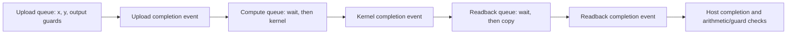

# Native cross-queue event validation

The native SAXPY and ReLU fixtures now exercise explicit event dependencies
between upload, compute, and readback queues. This validates a synchronization
path needed by future runtime adapters while retaining the existing logical
kernel contract and separate executable model.

## Execution and ownership

Each round follows this dependency chain:



AMD HIP and NVIDIA CUDA Driver runners use three distinct nonblocking streams
and three timing-disabled events. They enqueue every stage before the host waits
on the final event. No host stream/device synchronization is used between
submissions. Events are reused after the preceding round completes. The
[session fixture](multi-vendor-sessions.md) now owns one reusable set of streams,
events, pinned host buffers, and device allocations across sizes and modules.

The Level Zero runner uses three asynchronous queue handles in the selected
compute-capable queue group, with three regular command lists. Multiple queues
may use the same hardware queue index; this does not establish physical overlap.
A barrier signals upload completion after the three uploads. The kernel waits
on that event and signals compute completion; readback waits on compute and
signals the final event. Upload and compute events use device visibility scopes;
the final event uses host visibility scopes. All three events belong to a
host-visible pool scoped to the selected device.

The Level Zero host waits on the final event after submitting all three lists,
then confirms all three queue tails before resetting lists or events. This
accounts for command-list completion bookkeeping after event visibility. The
host waits are after pipeline submission, so they do not supply the dependency
edges between the stages.

Resources remain alive through completion. Partial submission unwinds queue
owners before event, list, allocation, module, or context owners. Producers are
submitted before consumers, so a failed later submission does not leave a
submitted consumer waiting for a producer that was never submitted.

AMD/NVIDIA host completion and cleanup use event/stream-query polling with a
30-second deadline and 1 ms backoff. A query error or an expired deadline leaves
completion unknown; the isolated validation process exits without unwinding and
freeing potentially active resources. Level Zero retains its bounded event and
queue waits and similarly terminates if queue completion cannot be established.
This is a validation-process failure policy, not a recoverable public runtime
error ABI or cancellation mechanism.

## Explicit capability qualification

Compiled runner descriptions now advertise `cross-queue-events`. This denotes
the implemented fixture path, not public event handles, timestamps, profiling,
or a general event API. Discovery still reports observed device identity and
limits separately from compiled adapter behavior.

The module ABI remains `therock.validation.f32-vector`, version 1, with the same
arguments, ownership, and logical copy-launch-copy ordering. Its contract SHA256
is unchanged. The contract describes the required result and ordering rather
than mandating a single physical queue; the event implementation satisfies that
ordering across three queues. Catalog schema 2, registry schema 1, description
protocol 1, inventory schema 2, and KPAK v1 remain unchanged.

Callers can explicitly require adapter behavior independently of the kernel ABI:

```sh
PYTHONPATH=rocm-systems/shared/kpack/python \
  .venv/bin/python build_tools/dispatch_multi_vendor_modules.py \
  --dist-root build/multi-vendor/dist/multi-vendor-modules run \
  --module validation/relu --target nvidia:cuda:sm_120 \
  --format cubin --entry-point therock_module_relu \
  --require-capability cross-queue-events
```

The flag is repeatable for distinct known capabilities. Unknown or duplicate
requests fail explicitly. The dispatcher checks the registry's advertised
capabilities before driver discovery, binds the actual compiled description to
that registry entry, and repeats requirements in the shared guarded execution
path. The explicit `validate_multi_vendor_modules.py --runner ...` interface
supports the same requirement.

An older adapter implementing the original logical contract remains compatible
when no event capability is requested. It cannot qualify an event-required run.
The profile's packed-module CTests require `cross-queue-events`, so a stage with
an older compatible runner cannot silently pass the new qualification. Rebuild
the profile to regenerate compiled descriptions, executables, and registry
hashes. Completed-description and imported-input guards remain in force.

## Validation boundaries

Each successful round emits `SYNC ... mode=cross-queue-events queues=3 events=3`
after host completion, followed by its arithmetic and output-guard check. The
existing six sizes and three rounds cover tails, repeated event reuse, and
changing inputs. A matching description or a SYNC line alone does not establish
correct arithmetic; the native final PASS still requires all checks and cleanup
to succeed.

CPU event tests exercise the real AMD/NVIDIA host control flow through an SDK
interposition shim that defers queued work, follows event dependencies, and
emulates fixture arithmetic. These tests check sequencing and failure cleanup;
they do not validate driver scheduling or device code generation. Actual GPU
execution provides separate evidence for those paths.

Intel hardware event execution remains unqualified until the B70 is available.
The Intel host adapter compiles against Level Zero, and SPIR-V payloads remain
subject to offline validation; those checks cannot qualify event behavior on an
Intel GPU. No physical queue overlap, throughput improvement, event timing, or
production-consumer performance is claimed. Internal context/resource reuse is
now exercised by sessions. The [persistent service](multi-vendor-service.md)
adds connection-scoped module/buffer handles and protocol errors using one
queue; it does not expose this fixture's events. Public device/context/event
handles, shared-library dispatch tables, and recoverable driver errors remain
future work.
