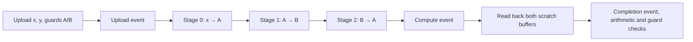

# Device-resident pipelines across module packs

`run-pipeline` composes packed fixture kernels through GPU buffers. Each stage
reads the previous stage's result; intermediate data stays on the selected
device until the chain completes. The native adapter owns the context, modules,
buffers, queues, and events for the complete run.

## Selecting a pipeline

Build `therock-dist`, then run from the Shark-a checkout:

```sh
PYTHONPATH=rocm-systems/shared/kpack/python \
  .venv/bin/python build_tools/dispatch_multi_vendor_modules.py \
  --dist-root build/multi-vendor-contracts/dist/multi-vendor-modules run-pipeline \
  --target nvidia:cuda:sm_120 \
  --module validation/saxpy cubin therock_module_saxpy \
  --module validation/relu ptx therock_module_relu \
  --module validation/saxpy cubin therock_module_saxpy
```

Each `--module` specifies `MODULE FORMAT ENTRY_POINT` in execution order. A
pipeline contains 1–32 stages for one exact target and device. Repeated stages
are allowed and reuse the same verified payload snapshot. NVIDIA can explicitly
mix cubin and PTX; AMD uses HSACO and Intel uses SPIR-V. The registry, catalogs,
contracts, executable hashes, and UUID identity checks remain in force. There
is no format, architecture, backend, or ABI fallback.

The dispatcher verifies every distinct selection before driver discovery. A
bad later stage prevents execution of all stages. It materializes verified
snapshots into private files held until the native process exits, including on
failure. Repeated stages use identical bytes; they currently have separate
loaded module/function handles. Distribution updates still require serialized
publication: separate verified catalog snapshots do not form an atomic release.

The native syntax is `--pipeline` plus repeated `--module FORMAT SYMBOL PATH`
and the global launch-contract/device flags. `--pipeline` requires module mode
and rejects legacy payload/symbol/format flags. Direct native invocation does
not verify catalogs. The existing `run` and `run-batch` interfaces remain
available; a batch checks independent fixtures, while a pipeline binds output
to the next stage's input.

## Dataflow and lifetime

For the example above, with `alpha = 1.75` and the same input vector `y` at every
stage:

| Stage | Module | Input     | Output    | Operation                         |
| ----- | ------ | --------- | --------- | --------------------------------- |
| 0     | SAXPY  | x         | scratch A | A = alpha × x + y                 |
| 1     | ReLU   | scratch A | scratch B | B = max(0, alpha × A + y − 0.125) |
| 2     | SAXPY  | scratch B | scratch A | A = alpha × B + y                 |



Every payload is inspected before driver initialization, and every module and
kernel is loaded and checked before fixture allocations or submission. One
selected device scope owns four maximum-sized device allocations (`x`, `y`,
A, B), four pinned host allocations, three queues, and three events. The output
alternates between A and B, so a stage never overwrites its own input. Resource
counts do not grow with stage count; loaded module handles do.

Each size and round uploads `x`, `y`, and fresh guards for both scratch buffers
once. AMD/NVIDIA enqueue all stages on one in-order compute stream after its
upload-event wait. Level Zero uses explicit execution/global-memory barriers
between launches; its first stage waits for the upload event and its final
stage signals compute completion. Both scratch arrays are copied back only
after that final event. Level Zero additionally signals readback completion
through a barrier after both copies and confirms all queue tails before reset.

There is no host synchronization or device-to-host transfer between stages.
The final check covers the most recent result retained in each scratch buffer,
plus its complete inactive tail. A one-stage pipeline leaves B entirely as
guards. Earlier overwritten intermediates are checked through their effect on
later results. All buffers, events, modules, and context references remain alive
until queues drain. Partial submission follows the existing bounded cleanup
policy. Unknown completion terminates the isolated runner without freeing
possibly active resources; completed kernels are not rolled back.

## Arithmetic and capability checks

The fixture uses sizes 1, 127, 128, 129, 4099, and 65539 with three input rounds
per size. A chain emits 18 `PIPELINE_CHECK` results, regardless of stage count.
Each result checks both retained scratch arrays and guards after all stages.
`PASS` requires every check and cleanup to succeed.

The CPU oracle stores FP32 stage intermediates. Intel explicitly stores separate
operation intermediates; AMD/NVIDIA host expressions may contract multiply/add.
A shared per-element absolute error recurrence allows CPU and GPU rounding
differences, including either separate operations or FMA contraction. It propagates prior
error through `abs(alpha)` and adds eight FP32 epsilons times the magnitudes of
the arithmetic operands, the optional ReLU bias, and propagated uncertainty,
plus a small absolute floor. ReLU does not amplify absolute error. This covers
cancellation, where a tolerance based only on the final result would be
insufficient. Scratch guards must match exactly. The bound is specific to
these bounded inputs, kernels, and 32-stage maximum; it is not a general math
provider accuracy contract.

`run-pipeline` automatically requires the compiled capabilities
`device-module-pipeline`, `multi-module-session`, and `cross-queue-events`.
Requirements are checked against both the packaged registry and actual compiled
adapter description. A compatible session adapter without pipeline support can
still serve `run-batch`, but cannot satisfy `run-pipeline`.

The kernel ABI remains `therock.validation.f32-vector` version 1 with unchanged
contract SHA256 `647e4ce315c7f3777ce40788f2ac62b1a62d1f964d7d0cbd4e8cfcfd7412ae8b`.
Its pointer/scalar argument layout supports these bindings without a payload
change. Catalog schema 2, registry schema 1, runner-description protocol 1,
inventory schema 2, and KPAK v1 remain unchanged. Rebuild the profile to regenerate
compiled descriptions, registry hashes, and completed-build receipts. Imported
SDK guards and restrictions on artifact-cache reuse still apply.

## Qualification boundaries

Packed CTests register three-stage SAXPY → ReLU → SAXPY pipelines for AMD HSACO,
NVIDIA cubin, NVIDIA PTX, mixed NVIDIA formats, and the deferred Intel/SM90
targets. The CPU scheduler interposes all AMD/NVIDIA driver calls and validates
actual stage argument bindings, allocation counts, ordering, delayed execution,
readback placement, and cleanup. These tests do not exercise device code or real
driver scheduling. Intel initialization-trap tests prove invalid pipeline
requests fail before driver access; they do not qualify Level Zero execution.

This is a bounded vector fixture with fixed argument bindings and linear
execution. A subsequent [persistent service](multi-vendor-service.md) exposes
connection-scoped buffer/module handles, caller arrays, and recoverable protocol
validation errors. Public device/context/event handles, arbitrary graph edges,
general argument binding, a shared-library plugin interface, driver-error
recovery, cancellation, and math providers remain roadmap work. Intel B70 and NVIDIA SM90
hardware execution remain deferred. No throughput, transfer-volume, startup,
or physical overlap improvement has been measured.

## Shark-a validation record

The 7 September 2026 pipeline increment passed 277 focused tests with no
failures or skips. The native profile passed 17 CTests, including four
three-stage GPU pipeline cases, four batch cases, and six single-module cases.
The pipelines completed 72 final arithmetic/guard checks across 216 stage
launches, with zero observed difference from their stored FP32 references.
The combined native/HIP profile passed 21 CTests, including both HIP wrapper
paths. These runs overlap and are not an additive unique-test total.

Separate 32-stage alternating pipelines also passed on both the Radeon and
NVIDIA card: 18 checks and 576 stage launches per card. These deeper chains had
nonzero FP32 rounding differences (maximum absolute difference 112) and passed
the per-element propagated bounds. This does not establish a fixed absolute
error guarantee for arbitrary chain lengths or inputs.

Fifteen AMD/NVIDIA CPU scheduler tests passed across three compiled runners,
and five Intel initialization-boundary tests passed. Deliberately broken native
copies with a missing upload dependency or an incorrect later-stage input were
rejected by the scheduler. All twelve packed variants passed integrity checks;
both Intel SPIR-V modules passed offline validation, and four SM90 variants
passed architecture inspection. Intel/SM90 hardware execution remains deferred.

Evidence is on Shark-a at
`build/multi-vendor/validation-results/device-pipelines/`, including `report.json`,
`source-files.json`, the cumulative `working-tree.patch`, and logs. At that
checkpoint the increment was uncommitted; its source hashes identify the tested
state, which predates the final publication commit.
