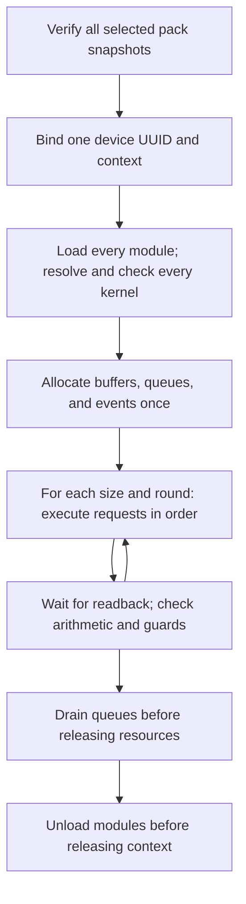

# Native sessions across module packs

The unified dispatcher can run explicitly selected modules from independent
packs inside one native runner process. The fixture reuses a device context,
three device buffers, three pinned host buffers, and three queues/events while
alternating SAXPY and ReLU. This exercises ownership and module lifetime before
defining a public runtime plugin interface.

## Exact selection and invocation

Run from the Shark-a checkout after building `therock-dist`:

```sh
PYTHONPATH=rocm-systems/shared/kpack/python \
  .venv/bin/python build_tools/dispatch_multi_vendor_modules.py \
  --dist-root build/multi-vendor-contracts/dist/multi-vendor-modules run-batch \
  --target nvidia:cuda:sm_120 \
  --module validation/saxpy cubin therock_module_saxpy \
  --module validation/relu ptx therock_module_relu
```

Each `--module` takes `MODULE FORMAT ENTRY_POINT`. Order is preserved. A session
accepts 1–32 distinct requests for one exact target and one selected device.
The same logical module can select two explicit formats, but an identical
module/format/entry-point request is rejected. NVIDIA can mix cubin and PTX
inside the session: both must load successfully; neither replaces the other.
AMD requests HSACO and Intel requests SPIR-V. Hardware qualification for Intel
B70 and NVIDIA SM90 remains deferred.

`--device` and `--device-uuid` retain the existing mutually exclusive selectors.
The dispatcher verifies the runner, every selected payload snapshot, all launch
contracts, and adapter requirements before device discovery. It then resolves
and binds the device UUID, rechecks the runner executable, and writes the
verified snapshots into one private temporary directory held until runner exit.
A bad later request cannot launch an earlier module. A driver failure after
execution starts fails the session; completed kernels are not rolled back.

The native process receives repeated `--module FORMAT SYMBOL PATH` arguments and
one set of contract/device flags. That native batch syntax is mutually exclusive
with legacy `--payload`, `--symbol`, and `--payload-format`. The dispatcher uses
catalog identities; the native runner uses already selected file paths. Direct
native invocation still bypasses catalog/pack verification.

## Session lifetime



Every payload is inspected before driver initialization. Every module and kernel
is loaded and checked before allocating fixture buffers or launching work.
Loaded handles remain stable until all session work has completed. Each size
(1, 127, 128, 129, 4099, 65539) and round (three per size) executes every request
against the same allocations. The two-module fixture therefore performs 36
arithmetic and guard checks in alternating module order. Maximum-sized buffers
are allocated once. Input transfers use the current logical size. Intel checks
17 output guards; AMD/NVIDIA also transfer and guard the entire inactive output
tail. Inputs vary by round, and the CPU reference is selected per module.

The [event dependency chain](multi-vendor-events.md) remains upload → compute →
readback. AMD/NVIDIA use nonblocking streams and timing-disabled events. Intel
reuses its regular command lists after queue-tail completion, resetting lists
and events before reuse. All backends retain modules, buffers, and events while
work may be pending. Partial submissions drain before cleanup; unknown
completion terminates the isolated runner without freeing possibly active
resources. This policy is unsuitable as a public recoverable error API.

`SESSION` records the intended resource counts; `CHECK` records the module index
and symbol as well as size, round, arithmetic, and guards. A successful `PASS`
requires the entire session and cleanup to succeed. These logs alone do not
prove allocation counts; CPU interposition tests independently check native
calls and lifetimes. CUDA retains the selected device's primary context; HIP
uses the selected device's runtime-managed context. The session owns one device scope
and does not create a new context for each module.

## Compatibility and qualification

The compiled adapter capability `multi-module-session` describes this bounded
fixture behavior. `run-batch` automatically requires it and `cross-queue-events`
from both the registry and actual compiled description. Additional distinct
known requirements can be supplied with `--require-capability`. Legacy `run`
remains available to compatible older adapters when extra capabilities are not
requested. Rebuild the profile to regenerate the executable, descriptions,
registry hashes, and completed-build receipts.

The kernel ABI remains `therock.validation.f32-vector` version 1 with unchanged
contract SHA256 `647e4ce315c7f3777ce40788f2ac62b1a62d1f964d7d0cbd4e8cfcfd7412ae8b`.
Catalog schema 2, registry schema 1, runner-description protocol 1, device
inventory schema 2, and KPAK v1 stay unchanged. Imported-input guards and the
existing restrictions on cache reuse remain in force.

Profile CTests exercise AMD HSACO, NVIDIA cubin, NVIDIA PTX, and mixed NVIDIA
cubin/PTX sessions, alongside the prior single-module and HIP wrapper tests.
Intel and SM90 tests are registered for future hardware qualification. CPU
interposition tests use distinct module/function handles and delayed queues to
check reuse, alternating functions, module lifetime, and cleanup failures. Intel
offline tests trap initialization to prove malformed later requests fail before
driver access. Neither kind of CPU test qualifies device code or Intel runtime
execution.

This batch path remains a bounded fixture executed through a child process.
The subsequent [persistent service](multi-vendor-service.md) adds connection-scoped
module/buffer handles and a versioned request/reply API for caller data. Public
device/context/event handles, general argument binding, a shared-library dispatch
table, multi-device execution, and cancellation remain future work.
Catalog reads are independent snapshots, not an atomic
multi-pack release transaction. Distribution updates must be serialized with
use. No physical queue overlap, startup savings, or throughput improvement has
been measured.

## Shark-a validation record

The 7 September 2026 session increment passed 264 focused Python/native host
tests with no failures or skips. The native profile passed 13 CTests: four
two-module GPU sessions (144 arithmetic/guard checks), six single-module GPU
cases (108 checks), device discovery, and two input-provenance fixtures. All 252
event pipelines completed, with maximum observed arithmetic error zero. The
combined HIP/native profile passed 17 CTests, including both HIP wrapper paths.
These overlapping runs are separate evidence, not an additive unique-test total.

CPU coverage includes ten AMD/NVIDIA event/session tests over three compiled
runners and three Intel initialization-boundary tests. All twelve packed
variants were hash-verified; both Intel SPIR-V modules passed offline validation,
and the four SM90 payloads passed architecture inspection. Four compiled,
configured, completed, and installed runner descriptions agreed. No-op builds
preserved installed/generated/object contents and modification times.

Evidence resides on Shark-a at
`build/multi-vendor/validation-results/module-sessions/`, including `report.json`,
`source-files.json`, the cumulative `working-tree.patch`, and test/build logs.
At that checkpoint the increment was uncommitted; its source hashes identify
the tested state, which predates the final publication commit.
Intel/SM90 hardware execution and performance qualification remain deferred.

The subsequent [device-pipeline path](multi-vendor-pipelines.md) composes stages
through alternating GPU scratch buffers, requiring `device-module-pipeline` in
addition to session/event support. It adds a fourth buffer and delays readback
until all stages finish. The session evidence above remains tied to its stated
snapshot.
